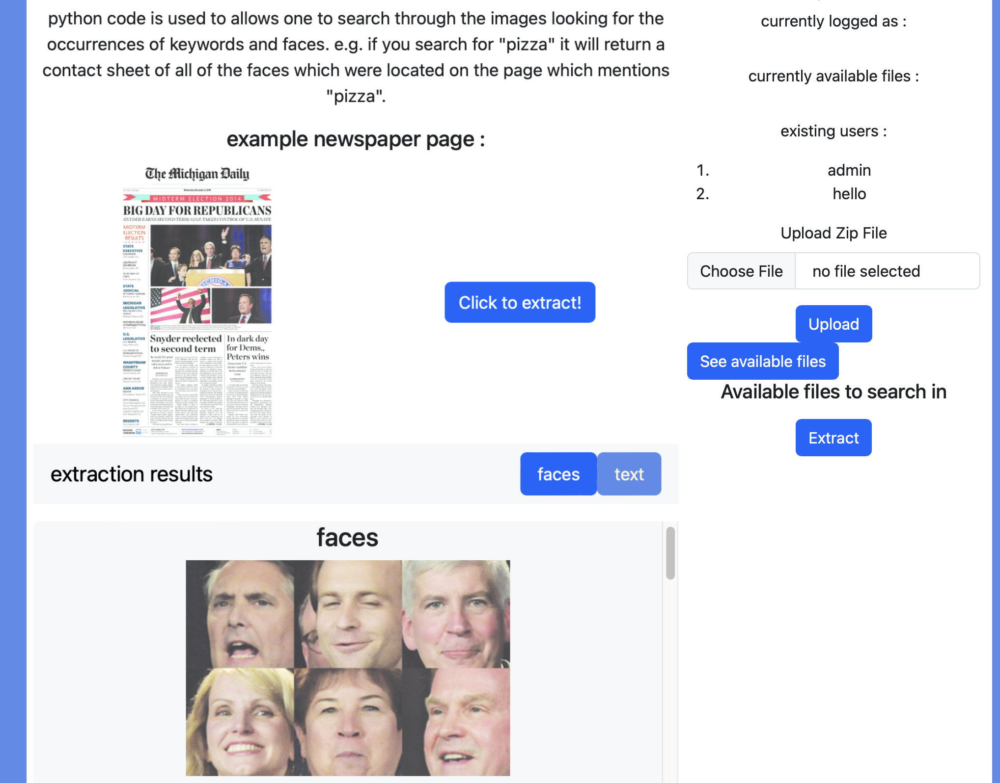

## Text and face text extraction and search engine (web app in development)

### Steps: 

#### Upload : 
Users can log in upload their zip files

#### Extract : 
This step takes a little while, once extracted, text files and face image files are stored on the server and 
managed by SQLite with Flask-SQLAlchemy.
Users can then access the extracted files quickly after.

#### Search : 
python code is used to allows one to search through the images looking for the occurrences of keywords and faces. e.g. if you search for "pizza" it will return a contact sheet of all of the faces which were located on the page which mentions "pizza".

#### Preview of the web app in construction : 

